# VibeCodePlatform
# Continue: Complete Architecture Deep Dive for Researchers

## 1. Project Overview and Vision

**Continue** is an open-source AI coding assistant that integrates into IDEs (VS Code, JetBrains) and provides a CLI interface. It aims to be the "copilot for developers" with features like:

- Chat with AI about code
- Tab autocomplete
- Agent-based workflows
- Code editing and generation
- Codebase indexing and retrieval

---

## 2. High-Level Architecture

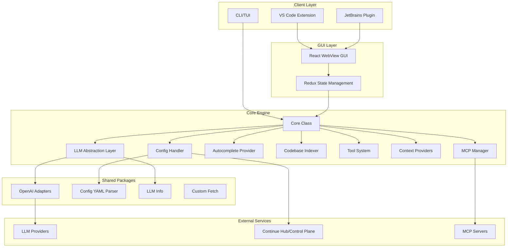

---

## 3. Directory Structure and Module Breakdown

### 3.1 Root Structure

```
continue/
├── core/           # Core business logic (TypeScript)
├── gui/            # React-based GUI (WebView)
├── extensions/     # IDE extensions (VS Code, JetBrains, CLI)
├── binary/         # Standalone binary for JetBrains
├── packages/       # Shared NPM packages
├── sync/           # Rust-based file sync (Merkle trees)
├── docs/           # Documentation (Mintlify)
└── scripts/        # Build and utility scripts
```

### 3.2 Core Module ([core/](core/))

The heart of the application:

| Directory | Purpose |

|-----------|---------|

| `llm/` | LLM abstraction layer with 50+ provider implementations |

| `autocomplete/` | Tab completion engine with context retrieval |

| `indexing/` | Codebase indexing (chunks, embeddings, FTS) |

| `context/` | Context providers (@file, @codebase, @docs, etc.) |

| `tools/` | Agent tool definitions and implementations |

| `config/` | Configuration loading and profile management |

| `protocol/` | Type-safe message protocol definitions |

| `edit/` | Code editing and diff streaming |

| `nextEdit/` | Predictive next-edit suggestions |

---

## 4. Communication Architecture

### 4.1 Three-Layer Protocol System

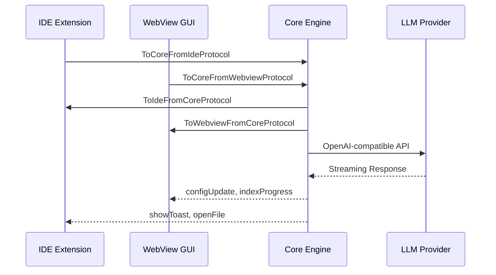

### 4.2 Messenger Pattern

The project uses a **typed messenger pattern** for cross-boundary communication:

```typescript
// Protocol definition (core/protocol/index.ts)
export type ToCoreProtocol = ToCoreFromIdeProtocol & 
  ToCoreFromWebviewProtocol & 
  ToWebviewOrCoreFromIdeProtocol;
```

Key files:

- [`core/protocol/messenger.ts`](core/protocol/messenger.ts) - Base messenger interface
- [`extensions/vscode/src/extension/VsCodeMessenger.ts`](extensions/vscode/src/extension/VsCodeMessenger.ts) - VS Code implementation
- [`binary/src/IpcMessenger.ts`](binary/src/IpcMessenger.ts) - IPC for JetBrains

---

## 5. Core Engine Deep Dive

### 5.1 Core Class ([core/core.ts](core/core.ts))

The `Core` class is the central orchestrator:

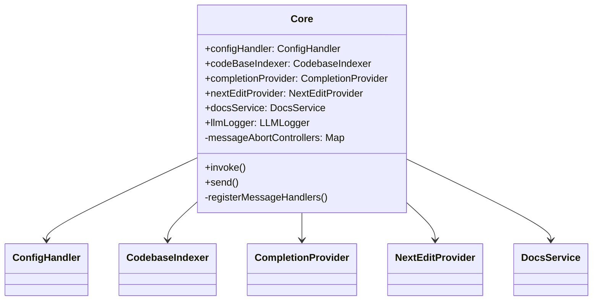

**Key responsibilities:**

1. Initialize all subsystems
2. Register 80+ message handlers
3. Coordinate config reloads
4. Manage abort controllers for cancellation

### 5.2 Configuration System ([core/config/ConfigHandler.ts](core/config/ConfigHandler.ts))

Multi-layered configuration with profiles:

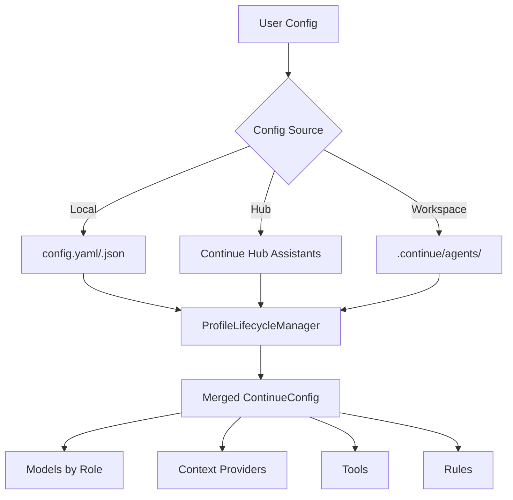

**Key concepts:**

- **Organizations** - Group profiles (Personal, Team)
- **Profiles** - Configuration snapshots (local or hub-based)
- **Cascading reload** - Changes propagate through the system

---

## 6. LLM Abstraction Layer

### 6.1 Provider Architecture

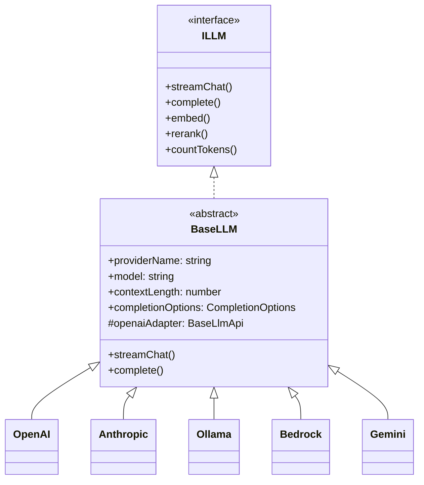

### 6.2 OpenAI Adapters Package ([packages/openai-adapters/](packages/openai-adapters/))

Normalizes all providers to OpenAI-compatible format:

```typescript
// packages/openai-adapters/src/index.ts
export function constructLlmApi(config: LLMConfig): BaseLlmApi {
  switch (config.provider) {
    case "openai": return new OpenAIApi(config);
    case "anthropic": return new AnthropicApi(config);
    case "gemini": return new GeminiApi(config);
    // ... 30+ providers
  }
}
```

**Supported providers:** OpenAI, Anthropic, Google Gemini, AWS Bedrock, Azure, Ollama, Together, Groq, Mistral, DeepSeek, Cohere, and 40+ more.

---

## 7. Autocomplete System

### 7.1 Flow Architecture

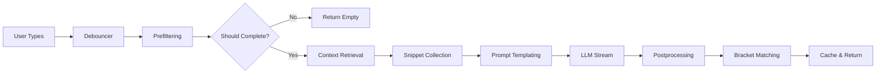

### 7.2 Key Components ([core/autocomplete/](core/autocomplete/))

| Component | File | Purpose |

|-----------|------|---------|

| CompletionProvider | `CompletionProvider.ts` | Main orchestrator |

| ContextRetrievalService | `context/ContextRetrievalService.ts` | Gathers relevant code context |

| Snippet Collection | `snippets/index.ts` | Collects code snippets for context |

| Prompt Templating | `templating/index.ts` | Renders FIM prompts |

| Postprocessing | `postprocessing/index.ts` | Cleans and validates completions |

**Context sources:**

- Recently edited files
- Open files (LRU cache)
- Git diff
- LSP definitions
- Clipboard (experimental)

---

## 8. Codebase Indexing

### 8.1 Index Types

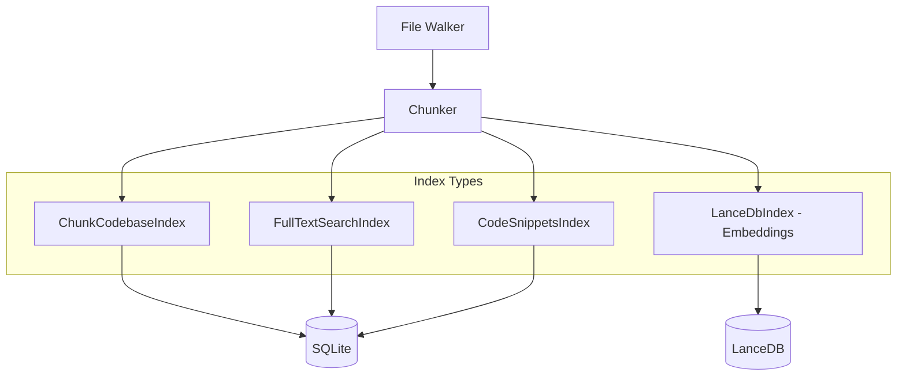

### 8.2 CodebaseIndexer ([core/indexing/CodebaseIndexer.ts](core/indexing/CodebaseIndexer.ts))

**Features:**

- Incremental indexing (only changed files)
- Multiple index types for different retrieval strategies
- Progress reporting to GUI
- Pause/resume capability
- `.continueignore` support

**Chunking strategies:**

- Basic line-based chunking
- Code-aware chunking (respects function boundaries)
- Markdown-aware chunking

---

## 9. Context Provider System

### 9.1 Provider Types

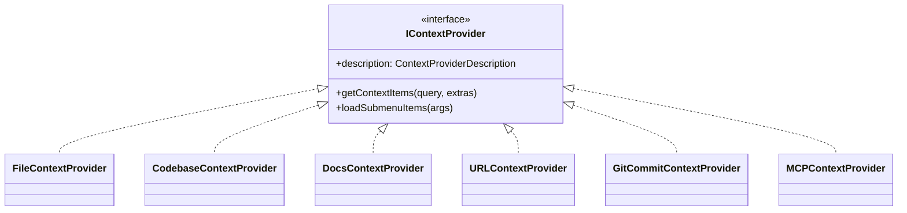

### 9.2 Built-in Providers ([core/context/providers/](core/context/providers/))

| Provider | Trigger | Purpose |

|----------|---------|---------|

| `@file` | `@file:path` | Include specific files |

| `@codebase` | `@codebase query` | Semantic search across codebase |

| `@docs` | `@docs query` | Search indexed documentation |

| `@url` | `@url:https://...` | Fetch and include URL content |

| `@diff` | `@diff` | Current git diff |

| `@terminal` | `@terminal` | Recent terminal output |

| `@problems` | `@problems` | Linter errors |

---

## 10. Tool System (Agent Mode)

### 10.1 Tool Architecture

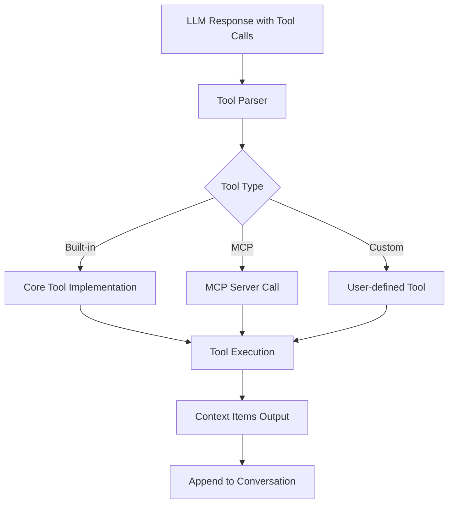

### 10.2 Built-in Tools ([core/tools/](core/tools/))

| Tool | Purpose | Read-only |

|------|---------|-----------|

| `readFile` | Read file contents | Yes |

| `editFile` | Apply code changes | No |

| `createNewFile` | Create new files | No |

| `runTerminalCommand` | Execute shell commands | No |

| `grepSearch` | Search with regex | Yes |

| `globSearch` | Find files by pattern | Yes |

| `viewSubdirectory` | List directory contents | Yes |

| `searchWeb` | Web search | Yes |

### 10.3 Tool Policy System

```typescript
// core/tools/policies/fileAccess.ts
export type ToolPolicy = "allow" | "deny" | "ask";

// Tools can evaluate their own policies based on args
evaluateToolCallPolicy?: (
  basePolicy: ToolPolicy,
  parsedArgs: Record<string, unknown>,
  processedArgs?: Record<string, unknown>,
) => ToolPolicy;
```

---

## 11. MCP (Model Context Protocol) Integration

### 11.1 MCP Manager ([core/context/mcp/MCPManagerSingleton.ts](core/context/mcp/MCPManagerSingleton.ts))

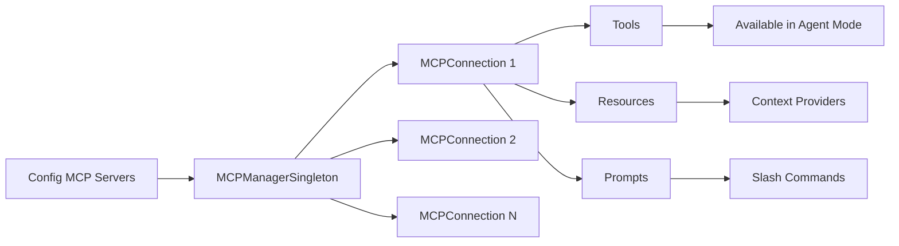

**Transport types supported:**

- `stdio` - Local process
- `sse` - Server-Sent Events
- `websocket` - WebSocket
- `streamable-http` - HTTP streaming

---

## 12. GUI Architecture

### 12.1 React + Redux Architecture ([gui/src/](gui/src/))

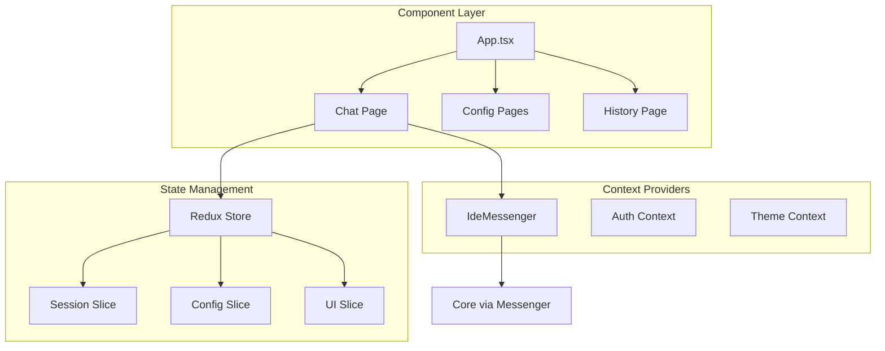

### 12.2 Key GUI Features

- **Streaming chat** with markdown rendering
- **Code block syntax highlighting** with copy/apply buttons
- **Tool call visualization** with approval UI
- **Session management** with history
- **Model selection** dropdown
- **Context item pills** (@file, @codebase, etc.)

---

## 13. Extension Architecture

### 13.1 VS Code Extension ([extensions/vscode/](extensions/vscode/))

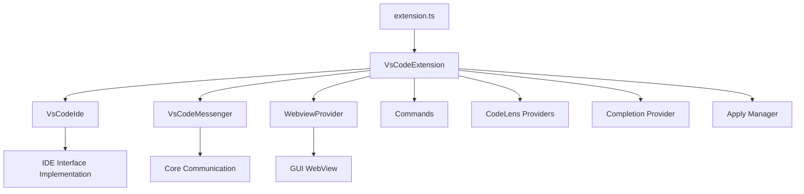

**Key components:**

- `VsCodeIde.ts` - Implements the `IDE` interface
- `ContinueGUIWebviewViewProvider.ts` - Hosts the React GUI
- `completionProvider.ts` - Tab autocomplete integration
- `ApplyManager.ts` - Handles code application with diff view

### 13.2 JetBrains Plugin ([extensions/intellij/](extensions/intellij/))

Written in Kotlin, communicates with a **standalone binary**:

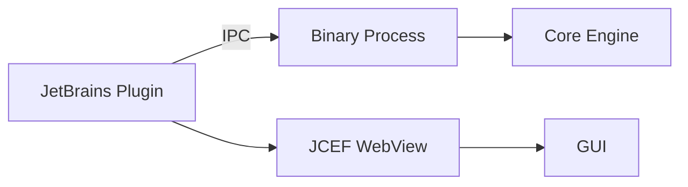

### 13.3 CLI Extension ([extensions/cli/](extensions/cli/))

Full-featured terminal interface:

- **TUI mode** - Interactive terminal UI with Ink (React for CLI)
- **Headless mode** - For CI/CD and automation
- **Remote mode** - Connect to remote Continue instances

---

## 14. Data Flow Examples

### 14.1 Chat Message Flow

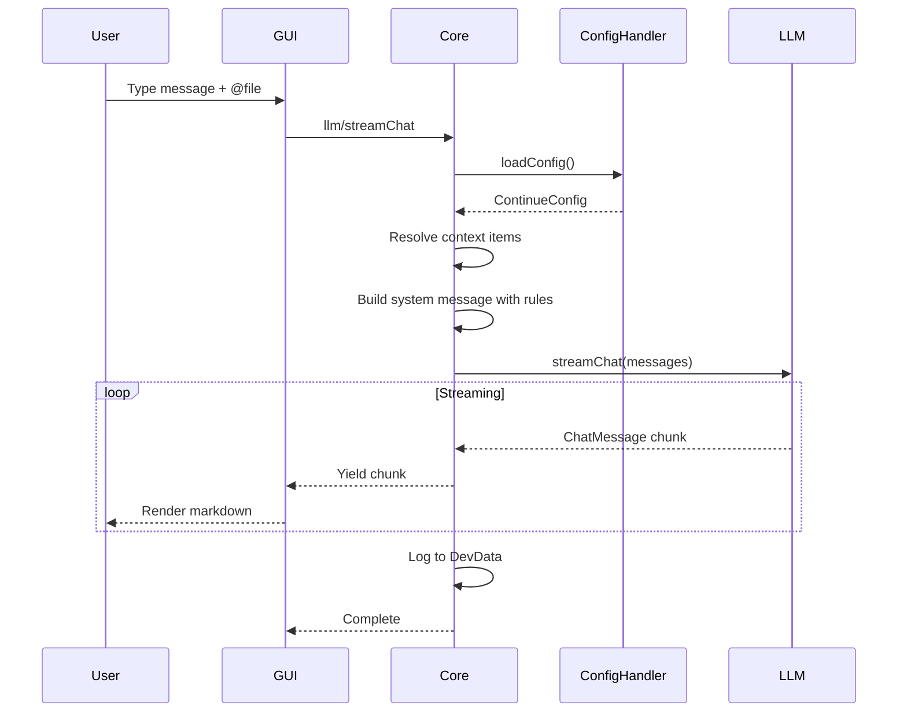

### 14.2 Autocomplete Flow

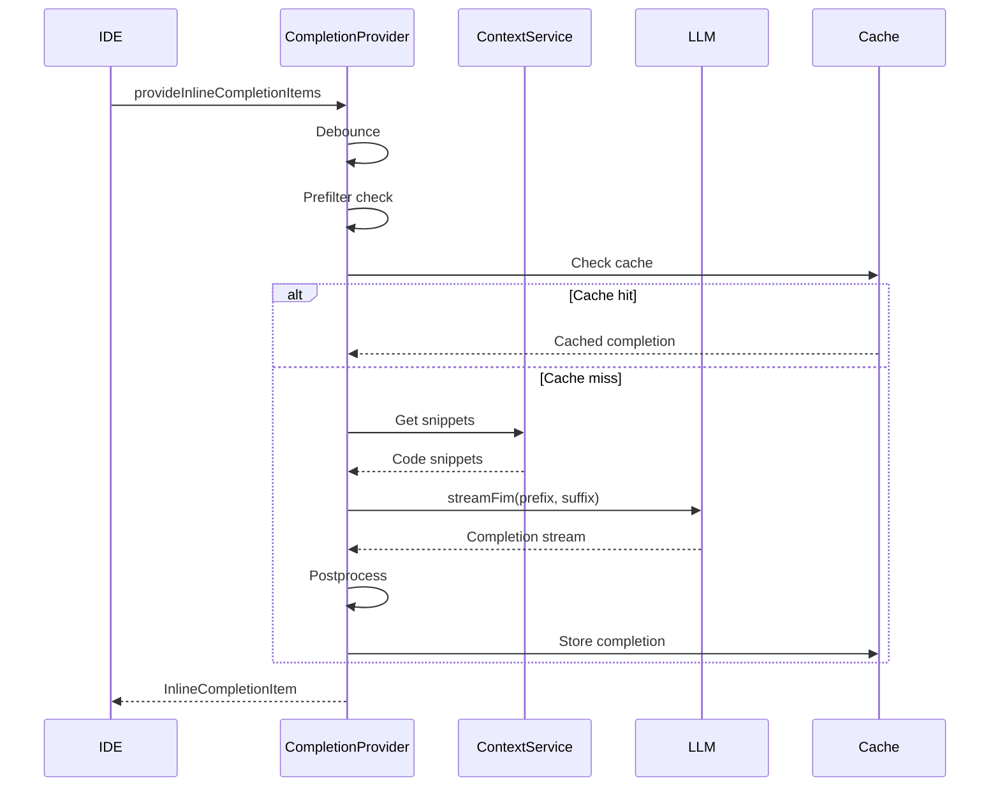

---

## 15. Strengths of the Architecture

### 15.1 What Continue Does Well

1. **Provider Abstraction**

   - Clean separation of LLM providers
   - OpenAI-compatible adapter pattern
   - Easy to add new providers

2. **Type-Safe Protocols**

   - Full TypeScript type safety across boundaries
   - Protocol definitions ensure contract compliance

3. **Modular Context System**

   - Pluggable context providers
   - MCP support for extensibility

4. **Caching Strategy**

   - LRU cache for autocomplete
   - SQLite for persistent indexes
   - Efficient incremental updates

5. **Cross-Platform Support**

   - Shared core across VS Code, JetBrains, CLI
   - WebView GUI works everywhere

6. **Configuration Flexibility**

   - YAML and JSON config support
   - Profile system for different contexts
   - Hub integration for shared configs

---

## 16. Areas for Improvement / Known Limitations

### 16.1 Technical Debt

1. **Large Core Class**

   - `core.ts` is 1500+ lines with 80+ handlers
   - Could benefit from splitting into domain modules

2. **Singleton Pattern Overuse**

   - `MCPManagerSingleton`, `PolicySingleton`, etc.
   - Makes testing harder

3. **Mixed Async Patterns**

   - Some callbacks, some promises, some async generators
   - Inconsistent error handling

### 16.2 Performance Considerations

1. **Indexing Performance**

   - Large codebases can be slow to index
   - No incremental embedding updates

2. **Memory Usage**

   - WebView + Core + Binary can be memory-heavy
   - No streaming for large file reads

3. **Startup Time**

   - Config loading involves multiple async operations
   - MCP server connections are sequential

### 16.3 Feature Gaps

1. **Multi-file Editing**

   - Agent mode handles this but UX could improve
   - No visual diff preview for multiple files

2. **Offline Support**

   - Limited functionality without network
   - Local models (Ollama) help but not seamless

3. **Debugging Integration**

   - Basic debugger context provider
   - No deep integration with breakpoints/stepping

---

## 17. Key Design Patterns Used

| Pattern | Usage | Location |

|---------|-------|----------|

| **Adapter** | LLM provider normalization | `packages/openai-adapters/` |

| **Messenger/Mediator** | Cross-boundary communication | `core/protocol/` |

| **Strategy** | Context providers, chunking | `core/context/`, `core/indexing/chunk/` |

| **Factory** | LLM construction | `constructLlmApi()` |

| **Observer** | Config change listeners | `ConfigHandler.onConfigUpdate()` |

| **Singleton** | Global state managers | `MCPManagerSingleton`, `GlobalContext` |

| **Template Method** | Base LLM with hooks | `BaseLLM` class |

| **Chain of Responsibility** | Autocomplete pipeline | `CompletionProvider` |

---

## 18. Technology Stack Summary

| Layer | Technology |

|-------|------------|

| Core Logic | TypeScript, Node.js |

| GUI | React, Redux, TailwindCSS, Vite |

| VS Code Extension | VS Code Extension API |

| JetBrains Plugin | Kotlin, IntelliJ Platform SDK |

| CLI | Ink (React for CLI), Commander.js |

| Database | SQLite (better-sqlite3), LanceDB |

| File Sync | Rust (Merkle trees) |

| Build | npm workspaces, esbuild |

| Testing | Vitest, Jest |

---

## 19. Recommendations for Building Similar Tools

### 19.1 Start With

1. **Define your protocol first** - Type-safe message contracts
2. **Build the core as a library** - Keep it IDE-agnostic
3. **Use adapter pattern for LLMs** - Provider explosion is real
4. **Invest in streaming** - Users expect real-time responses

### 19.2 Architecture Decisions

1. **Monorepo with shared packages** - Continue's approach works well
2. **WebView for GUI** - Cross-platform with modern UI
3. **SQLite for local storage** - Fast, reliable, no server needed
4. **Configuration as code** - YAML/JSON with schema validation

### 19.3 Avoid

1. **Tight coupling to one IDE** - Abstract the IDE interface early
2. **Synchronous operations** - Everything should be async/streaming
3. **Over-engineering config** - Start simple, add complexity as needed

---

## 20. Getting Started for Development

```bash
# Clone and setup
git clone https://github.com/continuedev/continue
cd continue

# Install dependencies (VS Code task or manual)
npm install
cd gui && npm install
cd ../core && npm install
cd ../extensions/vscode && npm install

# Run in development
# 1. Open in VS Code
# 2. Press F5 to launch extension development host
# 3. The GUI hot-reloads with Vite
```

This architecture analysis should provide a solid foundation for understanding how Continue works and how to build similar AI coding assistant tools.
